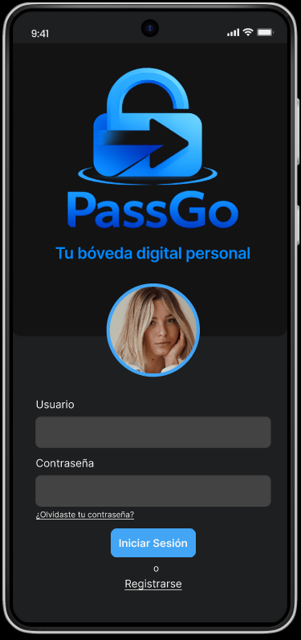
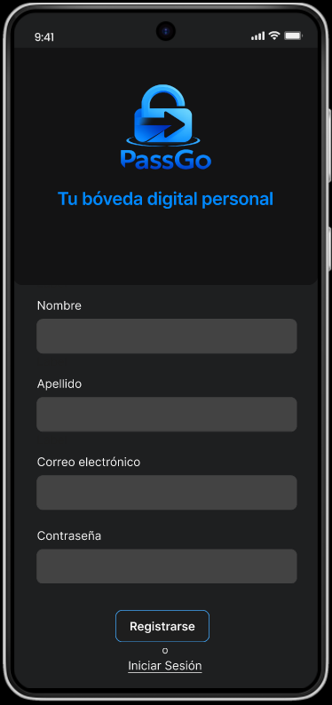
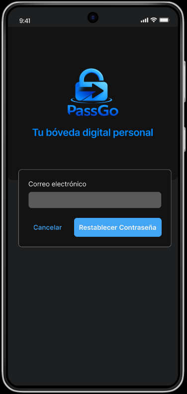
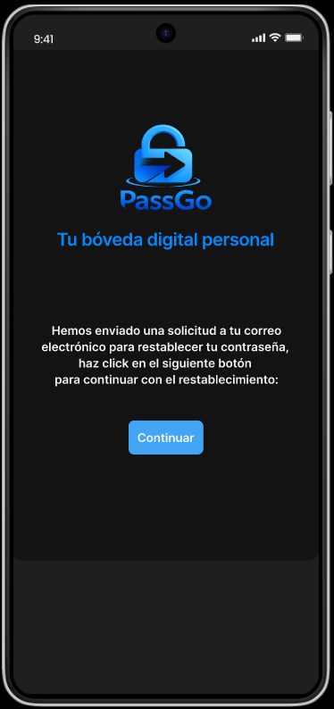
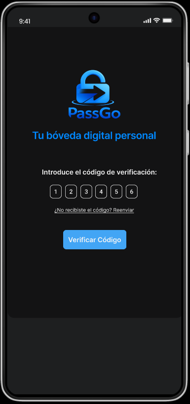
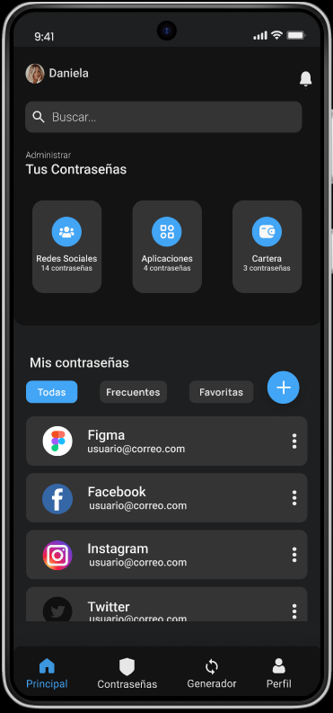
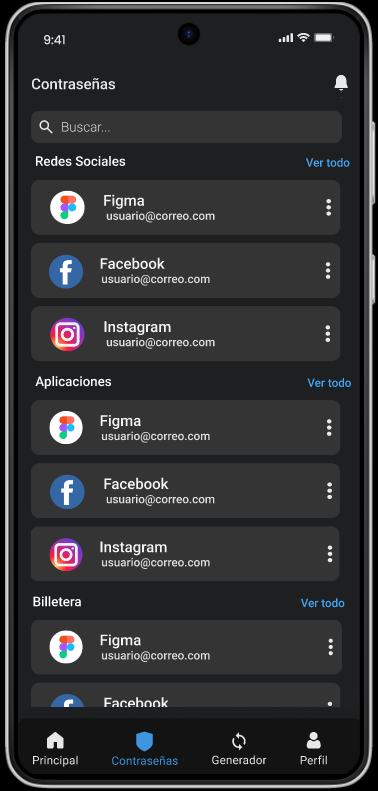
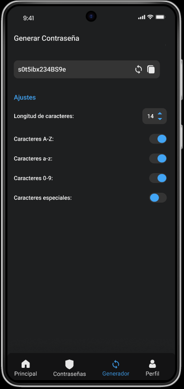
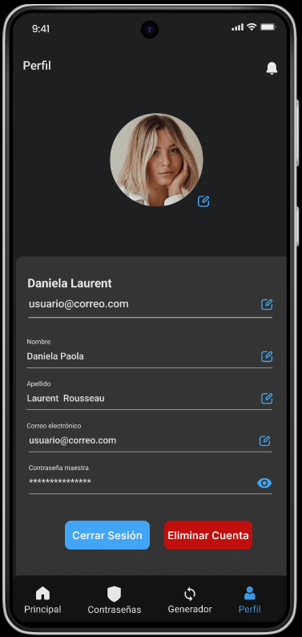

# Diseño - Gestor de Contraseñas

## 1. Descripción General
El sistema corresponde a una aplicación móvil para la gestión segura de contraseñas.

Diseño realizado en Figma:
https://www.figma.com/design/5o0LloKLvxA9a0R5p2F2FW/Gestor-de-contrase%C3%B1as--Community-?node-id=1-341&t=zKDe1go84K94e2tu-0

---

## 2. Paleta de Colores

| Elemento | Color |
|----------|-------|
| Primario | #42A5F5 |
| Fondo | #FFFFFF |
| Texto | #212121 |

---

## 3. Tipografía
- Fuente principal: Roboto
- Estilo: Minimalista y moderno

---

## 4. Flujo de Navegación
    Login --> Registro
    Login --> Restablecimiento
    Restablecimiento --> VerificacionCorreo
    VerificacionCorreo --> Codigo
    Login --> Principal
    Principal --> Gestion
    Principal --> Configuracion
    Principal --> Perfil
---

## 5. Componentes UI
- Botones de acción
- Íconos
- Formularios
- Campo de texto
- Tarjeta de contraseña

## ¿Qué se diseñó?

Se diseñó la interfaz gráfica de usuario (UI) para una aplicación móvil orientada a la gestión segura de contraseñas.  
El diseño fue desarrollado utilizando la herramienta Figma y corresponde a un prototipo funcional enfocado en la organización, visualización y administración de credenciales digitales.

El objetivo principal del diseño es proporcionar una experiencia intuitiva que permita al usuario almacenar y consultar sus contraseñas de manera sencilla y segura.

Actualmente, el proyecto se encuentra en fase de diseño, por lo que aún no cuenta con implementación funcional a nivel de desarrollo.

---

## ¿Cómo funciona?

El prototipo simula el comportamiento general de la aplicación mediante navegación interactiva entre pantallas.  
Cada vista representa una funcionalidad específica dentro del sistema, permitiendo observar el flujo lógico de uso sin necesidad de programación.

El funcionamiento se basa en la interacción del usuario con elementos visuales como botones e íconos, los cuales dirigen hacia diferentes secciones del sistema, recreando la experiencia de uso final esperada.

---

## ¿Qué ve el usuario?

El usuario visualiza una interfaz limpia y organizada que incluye:

- Pantalla principal con acceso a las contraseñas almacenadas.
- Secciones destinadas a la gestión y consulta de información.
- Elementos gráficos como tarjetas, botones e íconos representativos.
- Barra de navegación inferior para acceder rápidamente a las distintas funcionalidades.

La información se presenta de forma clara con el fin de reducir la complejidad visual y facilitar la interacción.

---

## ¿Cómo se navega?

La navegación dentro del prototipo se realiza mediante la selección de botones e íconos disponibles en la interfaz.

Principalmente, el desplazamiento entre pantallas se logra a través de la barra de navegación ubicada en la parte inferior, permitiendo al usuario cambiar entre las diferentes secciones de la aplicación con un solo clic.

Este tipo de navegación busca mejorar la accesibilidad y reducir el tiempo necesario para acceder a cada funcionalidad.

---

## ¿Qué estilos se usan?

Para el diseño de la aplicación se optó por un estilo minimalista, caracterizado por:

- Uso reducido de elementos visuales innecesarios.
- Distribución organizada del contenido.
- Predominio de espacios en blanco.
- Colores suaves que favorecen la legibilidad.
- Componentes simples y modernos.

Este enfoque permite mejorar la experiencia del usuario, haciendo que la interfaz sea intuitiva, moderna y fácil de utilizar.

## Mockups de la aplicación.

---

### Pantalla de Inicio de Sesión

### Pantalla de Registro

### Pantalla de Restablecimiento de Contraseña

### Pantalla de Verificación de Correo

### Pantalla de Código de Verificación

### Pantalla Principal

### Pantalla de Contraseñas

### Pantalla de Generador de Contraseñas

### Pantalla de Perfil

